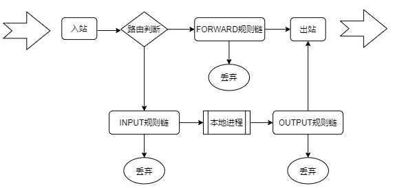

**网路防火墙**

- **分类方法**

  > 根据保护的对象来划分

  1. 主机防火墙
  2. 边界防火墙

  > 根据实现机制来划分

  1. 无状态包过滤：Stateless packet filtering
  2. 状态检测：Stateful inspection
  3. 应用程序网关：Application gateway
  4. 网络代理：Network proxy

- **TCP/IP参考模型中包过滤防火墙的位置**
  | 层级       | 功能                         | 防火墙位置                                     |
  | ---------- | ---------------------------- | ---------------------------------------------- |
  | 应用层     | 客户端和服务器应用程序       | Telnet客户端 web服务器                         |
  | 传输层     | TCP和UDP协议以及服务端口     | 包过滤防火墙 TCP和UDP源目端口、TCP连接状态标志 |
  | 网络层     | IP数据包、IP地址以及ICMP消息 | 包过滤防火墙 IP源目地址、IP ICMP控制代码       |
  | 数据链路层 | 以太网帧和MAC地址            | 网络接口卡                                     |
  | 物理层     | 铜线、光纤、微波、无线电     |                                                |

  > 网络接口卡输入输出流程图

  

  > 默认数据包过滤策略
  >
  > - 左边默认禁止一切，只有匹配规则才通行（推荐）

  

  > 驳回（Rejecting）vs. 禁止（Denying）
  >
  > - 驳回因为会给发送者返回错误信息，这将增加网络负载，有可能被攻击者提供有用信息，所以不建议使用驳回工作

  

- **过滤入站数据包**

  1. 远程源地址过滤

     - 通过数据包头中的源地址识别发送者，手段单一

     - 来自互联网包中源地址，以下为源地址欺骗和非法地址

       ```yaml
       - 回环接口地址: 127.0.0.0~127.255.255.255
       - 畸形广播地址: 0.0.0.0
       - A类网络的0地址: 0.0.0.0~0.255.255.255
       - APIPA地址: 169.254.0.0~169.0.2.255
       - 网络测试地址: 192.0.2.0~192.0.2.255
       ```

     - 阻止有问题主机、站点的访问

     - 允许特定远程主机和站点的访问

  2. 对本地目标地址进行过滤

     - 主机防火墙
       - 网络接口的地址
       - 有限广播：255.255.255.255
       - 子网广播：针对192.168.100.0/24子网就是192.168.100.255
     - 边界防火墙
       - 路由模式：内网主机的地址
       - NAT模式：外网接口的地址
       - 虚拟化中的NAT或路由模式

  3. 对远程源端口进行过滤

     - 远程客户端 =》本地服务资源的访问
       - 非特权范围内的端口：1024~65535
     - 远程服务器 =》本地客户机的响应
       - 服务端口
       - 如，web:80

  4. 对远程目标端口进行过滤

     - 远程客户端 =》本地服务资源的访问
       - 本地服务端口（如，web:80)
     - 远程服务器 =》本地客户机的响应
       - 本地客户机上的非特权范围内的端口：1024~65535

  5. 对TCP连接状态进行过滤

     - 远程客户端 =》本地服务资源的访问
       - 第一个数据包，设置了SYN
     - 远程服务器 =》本地客户机的响应
       - 每个包，设置了ACK

  6. 刺探和扫描

     - 刺探：probe
       - 尝试连接到一个单独的服务端口，根据端口响应作出判断
     - 扫描：scan
       - 对一台或多台主机的多个服务端口进行系列刺探
       - 通常自动执行
       - 扫描器之王：nmap
         - nmap = Network Mapper网络映射器
         - 采用GPL v2协议的开放源代码的网络探测和安全审核工具

  7. 拒绝服务攻击

     - 拒绝服务（Denial of Service: Dos）

     - 分布式拒绝服务（Distributed Denial of Service: DDos）

     - 常见类型

       ```yaml
       - ICMP Flood
       - SYN Flood
       - Teardrop Attacks
       - HTTP_Half_Connect
       - HTTP_Connect
       - UDP Flood
       - DNS Flood
       - ... ...
       ```

  8. 源路由

     - 现在很少使用源路由选项
     - 由起源设备定义路由
     - 有安全风险，建议禁用、丢弃
     - IP包头中的Option
       - 松散源路由
       - 严格源路由
       - 路由记录
       - 时间戳

- **过滤出站数据包**

  1. 对本机源地址进行过滤
  2. 对远程目标地址进行过滤
  3. 对本地源端口进行过滤
  4. 对远程目标端口进行过滤
  5. 对出站TCP连接状态进行过滤

- **私有网络和公有网络服务**

  1. 保护不安全的本地服务
     - "古老"的应用：r*类的应用
  2. 只应当在内网使用的应用
     - Samba/CIFS、NFS
     - iSCSI
     - SNMP
     - ... ...

- **iptables/firewall 和 netfilter**

  
  - netfilter如何控制数据包传输

    > 链容纳各种防火墙规则
    >
    > 链将规则按照时机来分类

    

    > iptables的5个链
    >
    > - 给本机某个进程的数据包：PREROUTING --> INPUT
    > - 由本机转发的数据包：PREROUTING --> FORWARD --> POSTROUTING
    > - 由本机发出的数据包：OUTPUT --> POSTROUTING

    

    | 表名     | 功能                             | 内核模块          | 链                                            |
    | -------- | -------------------------------- | ----------------- | --------------------------------------------- |
    | filter   | 过滤功能，确定是放行（默认）     | iptables_filter   | INPUT\|FORWARD\|OUTPUT                        |
    | nat      | 网络地址转换                     | iptables_nat      | PREROUTING\|INPUT*\|<br />OUTPUT\|POSTROUTING |
    | mangle   | 拆解、修改、重新封装数据包       | iptables_mangle   | All                                           |
    | raw      | 用来决定是否对数据包进行状态跟踪 | iptables_raw      | PREROUTING\|OUTPUT                            |
    | security | 用于强制访问控制(MAC)的网络规则  | iptables_security | All                                           |

    ```sh
    lsmod | grep iptable
    iptable_nat            12875  1 
    nf_nat_ipv4            14115  1 iptable_nat
    iptable_mangle         12695  1 
    iptable_security       12705  1 
    iptable_raw            12678  1 
    iptable_filter         12810  1 
    ip_tables              27126  5 iptable_security,iptable_filter,iptable_mangle,iptable_nat,iptable_raw
    ```

  - iptables中的5表5链的关系

    > 链是规则的集合，是检查站
    >
    > 表是根据功能来划分的，是具有相同功能的规则的集合

    

  - iptables语法

    ```sh
    IPTABLES(8)                                    iptables 1.4.21                                   IPTABLES(8)
    
    NAME
           iptables/ip6tables ? administration tool for IPv4/IPv6 packet filtering and NAT
    
    SYNOPSIS
           iptables [-t table] {-A|-C|-D} chain rule-specification
           ip6tables [-t table] {-A|-C|-D} chain rule-specification
           iptables [-t table] -I chain [rulenum] rule-specification
           iptables [-t table] -R chain rulenum rule-specification
           iptables [-t table] -D chain rulenum
           iptables [-t table] -S [chain [rulenum]]
           iptables [-t table] {-F|-L|-Z} [chain [rulenum]] [options...]
           iptables [-t table] -N chain
           iptables [-t table] -X [chain]
           iptables [-t table] -P chain target
           iptables [-t table] -E old-chain-name new-chain-name
    ```

    