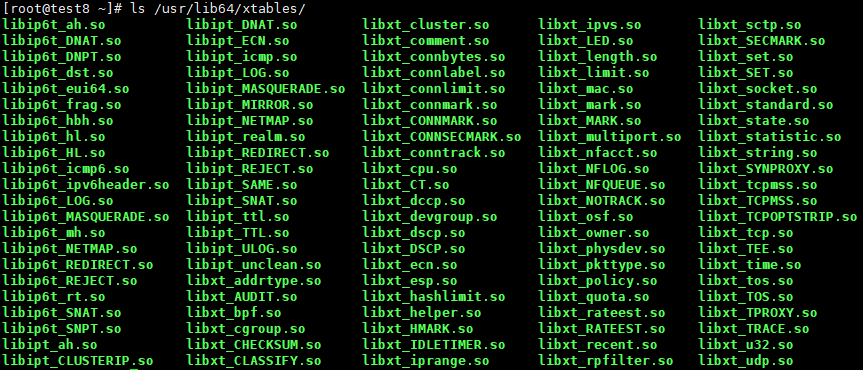
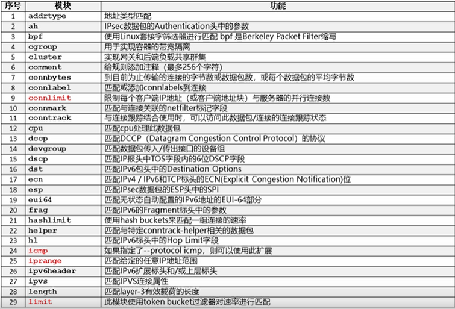
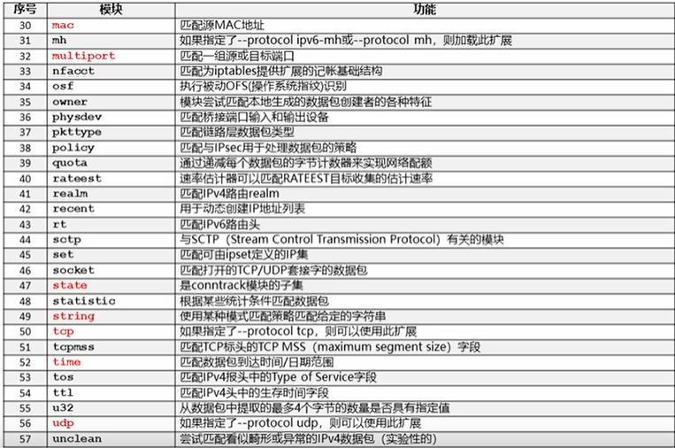

> 扩展：`ls /usr/lib64/xtables`
>
> 帮助：`man iptables-extensions`







> 匹配扩展

- -m | --match 扩展名称

- 可同时指定多个匹配扩展模块

- 使用 -h | --help 来获得该扩展的帮助信息

- 如果通过 -p 或 --protocol 指定协议（tcp、udp、icmp），当遇到有未知选项时，会自动加载与协议同名的匹配模块

- 常用 匹配扩展：

  ```sh
  multiport
  mac
  iprange
  state
  string
  connlimit
  time
  limit
  GeoIP # 自定义加载
  ```

- 多端口： `-m | --match multiport`

  > 必须紧跟在协议后面，最多可指定15个端口或范围
  >
  > 只能与以下协议之一使用：tcp、udp、udplite、dccp和sctp
  >
  > 注意：不要与以下通用匹配混淆
  >
  > ```sh
  > [!] --sport | --source-port port[:port]
  > [!] --dport | --destination-port port[:port]
  > ```
  >
  > 语法：
  >
  > ```sh
  > [!] --source-ports | --sports port[,port|,port:port] ...
  > # 如果源端口是给定端口之一，则匹配
  > 
  > [!] --destination-ports | --dports port[,port|,port:port] ...
  > # 如果目标端口是给定端口之一，则匹配
  > 
  > [!] --ports port[,port|,port:port] ...
  > 
  > # 示例
  > iptables -A INPUT -p tcp -m multiport --portS 22,80,1024:65535 -j ACCEPT
  > ```

- IP范围：`-m | --match iprange`

  > 匹配给定的任意IP地址范围
  >
  > 注意：不要与以下通用匹配混淆
  >
  > ```sh
  > [!] -s | --source address[/mask][,...]
  > [!] -d | --destination address[/mask][,...]
  > ```
  >
  > 语法：
  >
  > ```sh
  > [!] --src-range from[-to]
  > # 匹配指定范围内的源IP
  > 
  > [!] --dst-range from[-to]
  > # 匹配指定范围内的目标IP
  > 
  > # 示例：
  > iptables -I INPUT -m iprange --src-range 192.168.1.10-192.168.1.20 -j DROP
  > ```

- 字符串：`-m | --match string`

  > 匹配指定的字符串，要求Linux内核 >= 2.6.14
  >
  > 语法：
  >
  > ```sh
  > --algo {bm|kmp}
  > # 指定模式匹配策略(bm = Boyer-Moore, kmp = Knuth-Pratt-Morris)
  > # 示例：
  > iptables -A INPUT -p tcp --dport 80 \
  > -m string --algo bm --string 'GET /index.html' -j LOG
  > 
  > --from offset
  > # 设置开始偏移量，默认为0
  > --to offset
  > # 设置应扫描的偏移量，默认为数据包大小
  > # 字节偏移-1（从0开始计数）是最后扫描的字节
  > [!] --string pattern
  > # 匹配给定的模式
  > [!] --hex-string pattern
  > # 以十六进制表示法匹配给定的模式
  > ```

- 时间限制：`-m | --match time`

  > 匹配数据包到达时间/日期在是否在给定范围内
  >
  > 默认情况下，所有时间都被解释为UTC
  >
  > 语法：
  >
  > ```sh
  > --datestart yyyy[-MM[-DD[Thh[:mm[:ss]]]]]
  > --datestop yyyy[-MM[-DD[Thh[:mm[:ss]]]]]
  > --timestart hh:mm[:ss]
  > --timestop hh:mm[:ss]
  > [!] --monthdays day[,day...] # 可以使用数字1-7或Mon,Tue,Wed,Thu,Fri,Sat,Sun
  > [!] --weekdays day[,day...]  # 可以使用数字1-7或Mon,Tue,Wed,Thu,Fri,Sat,Sun
  > --kerneltz    # 使用内核时区而不是UTC  
  > --contiguous  # 指定跨日期时连续的时间，例如：星期一23:00到01:00
  > ```
  >
  > 

目标扩展


